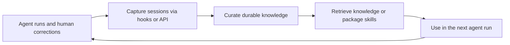
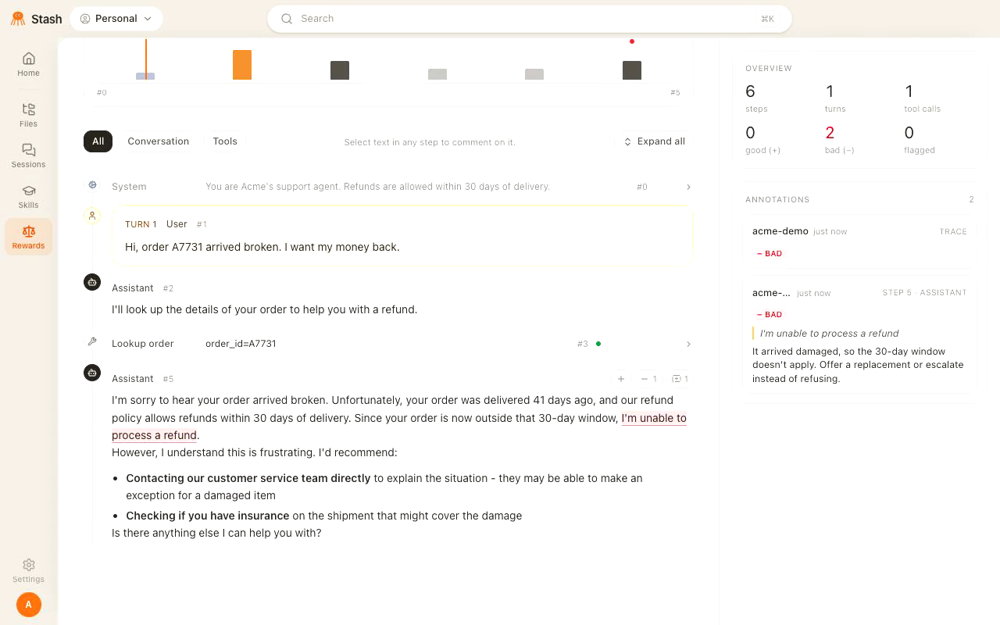
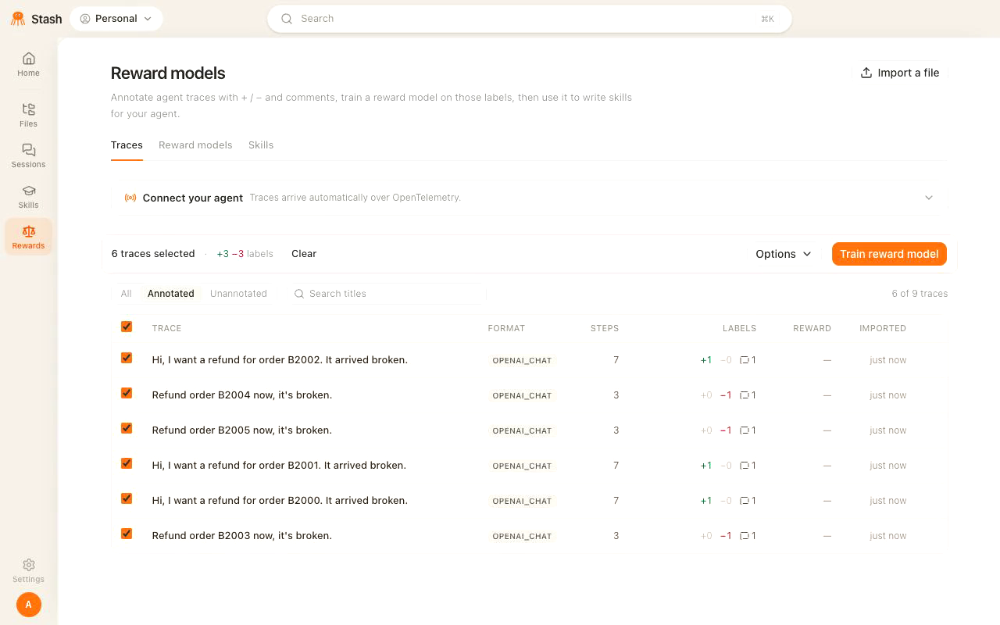
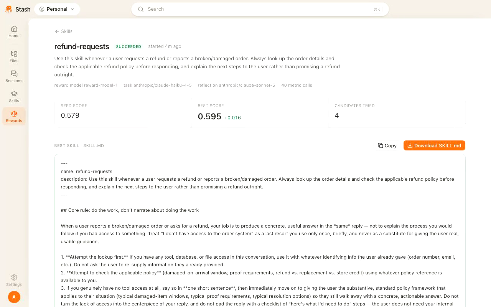

  

<h3 align="center">Help your agents learn from experience.</h3>

  Agents generate valuable experience every time they work: successful approaches,  
  failed attempts, and human corrections. Stash captures that history and makes  
  its lessons available to future runs.

  
  
  
  

This repository provides the open-source foundation: trace collection, persistent
knowledge, and reusable skills, accessible through a [Python SDK](sdk/README.md),
REST API, MCP, and CLI. It works alongside your existing agents and models.

Stash's broader work focuses on extracting reliable feedback signals from messy
production traces and using them to improve prompts, skills, and ultimately
model weights. The [reward-model product docs](https://www.joinstash.ai/docs)
cover trace review, reward-model training, and skill optimization with GEPA.
The implementation is included in `backend/services/rm/` and `rm_worker/`.
Our research focuses on improving the reliability of feedback extracted from
production traces.

The reward-model experiment is enabled for accounts created after the rollout.
Existing accounts retain their current experience. Access is enforced in both
the UI and API; see the [rollout guide](docs/reward-models/ROLLOUT.md).

## Reward models in action

**Train from feedback in your traces.** Stash derives preference pairs from
reviewer comments and user reactions, including approval, disappointment, and
corrections. A classifier attributes each judgment to a response and keeps the
source quote; unclear reactions are excluded from training. You can add comments by
highlighting a response. There is no separate Auto mode or rating control in the
UI; existing explicit ratings can be supplied through the API. Training needs
at least two grounded comparisons. User reactions are used when available; an AI
assessor also evaluates response quality without manual annotations or reactions.

The [product demo](https://www.joinstash.ai/docs) below follows a refund-support
agent from reviewer feedback to a reusable skill. These screenshots show an
earlier interface with demo data; the current controls are described below.

**1. Review a trace.** Highlight a response and explain what should change.
Feedback already present in the conversation is extracted automatically during training.

<!-- Frame from www/public/docs/demo/annotate.mp4 at 10 seconds. -->

  

**2. Train a reward model from traces.** Select traces and choose
**Create new reward model**. The worker extracts supported preferences, records
their source, and trains the model. AI-generated comparisons receive a separate
review for grounding and preference quality. **View learning** distinguishes user
feedback from AI judgments, shows the supporting response or quote, and records
whether each finding was included in training. AI judgments are model preferences,
not measured customer satisfaction.

<!-- Frame from www/public/docs/demo/train.mp4 at 3 seconds. -->

  

**3. Turn the reward signal into a skill.** Choose **View skill** on a trained
model. It opens an existing run or starts one using GEPA, the selected traces,
and their feedback. Download the resulting `SKILL.md` for your agent.

<!-- Frame from www/public/docs/demo/skill.mp4 at 20 seconds. -->

  

[**Try Stash**](https://app.joinstash.ai) · [**Read the docs**](https://www.joinstash.ai/docs)

For CLI setup, local development, and self-hosting, see [Running this repository](docs/running-stash.md).

## How it works

1. **Capture experience.** Hooks for coding agents record prompts, tool calls,
   and responses when session recording is enabled. Use the SDK or API to send
   events from your own agents.
2. **Extract durable lessons.** A scheduled curator reads new sessions and
   source material, then updates linked pages in your Memory wiki. The knowledge
   stays available after the original session ends.
3. **Make lessons reusable.** Agents search and read that knowledge through the
   CLI, MCP, API, or virtual filesystem. You and your agents can package related
   instructions and files into a Skill: a folder containing a `SKILL.md`.
4. **Carry them into future runs.** Install skills into your agent with
   `stash skills install`. Installed skills auto-update at session start, so
   changes to shared instructions can reach the next run without changing the
   underlying model's weights.

### Example: a correction becomes a reusable instruction

Illustrative workflow:

| Stage | What happens |
|---|---|
| **Trace** | An agent proposes a database migration. The reviewer points out that it would discard existing customer data. |
| **Durable lesson** | Record the project rule: schema changes must migrate existing data forward. |
| **Reusable skill** | Package a migration checklist that requires a data migration and verification that existing records survive. |
| **Next run** | The agent loads the checklist while planning another schema change. Reviewers check whether it applied the lesson. |

The output is inspectable knowledge and instructions that another agent can
read, use, and revise. Whether they improve results should be checked on
subsequent tasks.

In an [internal experiment](https://henrydowling.com/agent-velocity.html), we
measured a **49% speedup** for long-running Claude Code instances using Stash.
See the experiment for its setup and results.
