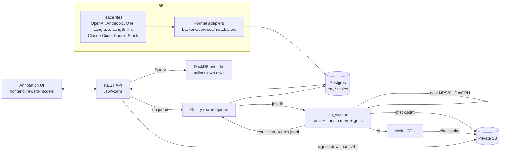

# Stash reward model training platform — design

Teams bring agent traces, annotate them the way they'd comment on a Google Doc
(highlight text and leave a comment), and train a reward model
from those annotations, the same kind of reward model used in RLHF. A second
optimizer, GEPA, writes a skill for the agent (a SKILL.md it loads into its
context) using the written comments as feedback and the trained reward model
as the metric.

This is a separate product area inside the Stash monorepo. It does not read or
write the existing `sessions` / `history_events` tables; connecting the two is
later work.

## Rollout

`users.reward_models_enabled` gates the reward-model API, routes, and sidebar.
Migration 0210 leaves every existing account disabled and sets the database
insert default to true for future accounts, including password and Auth0 signups.
The stored flag survives profile edits and later sign-ins. Existing accounts
retain their current workspace or developer console; new accounts land on Traces.
An operator can disable the flag for an individual account without deleting data.

The UI uses comments. Training derives attributable preferences from reviewer
comments and later user approval, disappointment, and corrections; API-supplied ratings also contribute
pairs. The backend image packages the lightweight Modal runner, a dedicated
`reward` worker coordinates jobs, and private S3 storage holds checkpoints.
See [Hosted rollout](ROLLOUT.md) for deployment settings and account isolation.

## Components



| Piece | Location | Notes |
|---|---|---|
| Migration | `backend/migrations/versions/0208_reward_model_platform.py` | all `rm_*` tables |
| Adapters | `backend/services/rm/adapters.py` | every input format → canonical trace |
| Services | `backend/services/rm/*.py` | traces, annotations, datasets, jobs, query |
| Router | `backend/routers/reward_models.py` | prefix `/api/v1/rm` |
| Celery tasks | `backend/tasks/reward_models.py` | dedicated `reward` exchange and queue; shells out to `rm_worker` |
| Worker | `rm_worker/` (top-level, own venv, own `requirements.txt`) | training, scoring, GEPA; API imports only the lightweight artifact helper |
| UI | `frontend/src/app/(app)/reward-models/` | traces, annotation view, models, GEPA |
| Public docs | `www/app/docs/` (Stash Reward Models is the docs site) | overview, trace format, annotations, training, GEPA, API |

The backend never imports torch. It writes a job directory, runs the worker as
a subprocess with `RM_WORKER_PYTHON`, and reads the results back. Both
`RM_WORKER_PYTHON` and `RM_ARTIFACT_DIR` are required the moment a job runs;
a missing value raises with a message naming the variable. The API requires
`RM_COMPUTE` (`local` or `modal`) when it accepts a training request. Both the
API and worker need the private S3 settings.

## Canonical trace format (Stash Trace Format, JSONL)

One trace per line. This is the import format, the export format, and the
shape every adapter produces.

```json
{
  "id": "optional-external-id",
  "title": "Refund request for order 1182",
  "metadata": {"agent": "support-bot", "model": "qwen3-8b"},
  "steps": [
    {"role": "system",    "content": "You are a support agent..."},
    {"role": "user",      "content": "I want a refund for order 1182"},
    {"role": "assistant", "content": "", "tool_name": "lookup_order",
     "tool_input": {"order_id": "1182"}, "tool_call_id": "call_1"},
    {"role": "tool",      "content": "{\"status\": \"delivered\"}", "tool_name": "lookup_order",
     "tool_call_id": "call_1"},
    {"role": "assistant", "content": "Your order was delivered on..."}
  ]
}
```

- `role` ∈ `system | user | assistant | tool`. `content` is always a string.
- `tool_name`, `tool_input` (object), `tool_call_id`, `metadata` are optional per step.
- `id` is optional; when present, re-importing the same `id` for the same owner
  replaces the trace's steps (annotations on the old steps are deleted with them).
- `title` is optional; when absent, the fast model generates a short task summary from the trace. Title generation requires the server Anthropic key and fails import if generation fails.
- Step `metadata.timestamp` holds a recorded ISO 8601 datetime with timezone. Claude Code, Codex, and timestamped OpenAI messages preserve their timestamps. Untimed messages stay untimed.
- `spans` records timed operations independently of conversation steps. OpenTelemetry imports preserve span IDs, parent IDs, nanosecond start/end times, operation names/kinds, recorded inputs/outputs, and references to retained message indices. The viewer plots overlapping operations on a shared time axis and nests subagents by parent ID. Untimed traces have an empty span list; no durations are inferred from step order.

### Supported input formats

`format` on import is one of the names below or `auto`. `auto` detects the
format from the payload's shape and fails with a 422 naming the formats it
tried when nothing matches.

| name | input | unit |
|---|---|---|
| `stash` | Stash Trace Format JSONL (above) | one trace per line |
| `openai_chat` | JSONL of `{"messages": [...]}` (fine-tuning format) or a JSON array of messages; handles `tool_calls` and `role: "tool"` | one trace per line |
| `anthropic_messages` | JSONL of `{"system": ..., "messages": [...]}`; content blocks `text`, `tool_use`, `tool_result`, `thinking` | one trace per line |
| `otel` | OTLP/JSON (`resourceSpans` and `resourceLogs`), single request or Collector file-exporter JSONL. Reads OTel GenAI semconv (`gen_ai.system_instructions`, `gen_ai.input.messages`, `gen_ai.output.messages`, the `gen_ai.client.inference.operation.details` event and the deprecated per-message log events), OpenInference (`llm.input_messages.*`, `llm.output_messages.*` incl. `message.contents`), and OpenLLMetry (`gen_ai.prompt.N.*`, `gen_ai.completion.N.*`). Built from LLM calls only; tool spans are not read because every tool call and result already appears in the next LLM call's messages. | one trace per `traceId` |
| `langfuse` | The `GET /api/public/traces/{traceId}` response (trace with `observations`), one object or a JSON array. Built from `GENERATION` observations. | one trace per trace |
| `langsmith` | LangSmith run export JSONL (runs with `trace_id`, `run_type`, `inputs`, `outputs`); built from `llm` runs ordered by `start_time` | one trace per `trace_id` |
| `claude_code` | Claude Code session transcript JSONL (`~/.claude/projects/**/*.jsonl`) | one trace per file |
| `codex` | Codex CLI rollout JSONL (`~/.codex/sessions/**/rollout-*.jsonl`) | one trace per file |

## Annotations

An annotation belongs to a trace and optionally to one step. It carries a
rating, a comment, or both.

| field | meaning |
|---|---|
| `step_id` | null = the whole trace; set = one step |
| `rating` | `1` (+), `-1` (−), or null |
| `comment` | free text, or null |
| `quote` | `{text, prefix, suffix}` — the highlighted span inside the step's content, anchored the same way page comments are (`page_comment_threads`). Requires `step_id`. |
| (system steps) | can carry comments (they feed GEPA) but not ratings: the reward model never sees system steps, so a rating there is a 422. A trace with only system steps fails import. |
| `label_error` | true = someone flagged this label as wrong. Flagged annotations are excluded from training and GEPA. |
| `label_error_note` | why it's wrong |

Annotation export (`GET /api/v1/rm/export/annotations`), one per line:

```json
{"trace_id": "…", "trace_external_id": "…", "step_index": 4, "rating": -1,
 "comment": "Promised a refund without checking the policy",
 "quote": {"text": "I've issued a full refund", "prefix": "Sure! ", "suffix": " to your card"},
 "label_error": false, "author": "henry", "created_at": "2026-09-29T03:12:00Z"}
```

## Reward model training

No manual annotations or user reactions are required. Each assistant response is
assessed for task completion, instruction adherence, evidence grounding and
appropriate uncertainty. A finding's `source` distinguishes `user_feedback` from
`ai_judgment`. AI judgments cite the target response, never fabricate user reactions,
and generate a grounded improvement or a plausible weaker alternative. A separate
model call reviews those comparisons using only the prior context; unsupported
revisions, ties and reversed preferences are excluded. Failed comparisons remain
visible in the learning report. These are model preferences, not measured customer
satisfaction, and held-out accuracy measures agreement with this supervision.
There is no promise that arbitrary empty or unassessable traces yield a dataset.

Training uses only the traces selected for the model. Explicit ratings supplied
through the API produce chosen/rejected pairs. A structured LLM classifier extracts
positive, negative, or unclear feedback from reviewer comments and later user
reactions, including implicit disappointment and approval. Labels attach to specific
assistant responses, so a failed response and a successful repair remain distinct.
The classifier distinguishes complaints about the task from reactions to the agent;
silence, new tasks, tool errors, and the assistant's own claims are not feedback.
For each assessable assistant response it generates an alternative to the same
context and records which response the assessment prefers. Human feedback cites
a verbatim excerpt; AI judgments carry a code-selected excerpt of the target
response. Only high-confidence positive/negative findings with a supported
alternative produce pairs. Confidence is the classifier's judgment, not a calibrated
probability. Generic disappointment can be recorded without inventing a correction.
Ambiguous feedback contributes no pair. System prompts and
future messages are excluded from the rendered training examples.

Code selects each target response, supplies its current text, and limits human
feedback evidence to later user messages or comments attached to that response.
Each call returns at most one judgment; code assigns its step index. Initial
requests and earlier feedback cannot be cited as evaluations of a later response.
Calls use schema-constrained output and run with bounded concurrency
(three per trace).
Evidence is also validated against the original source: the target must be an
assistant response, corrections must follow it, and step comments must belong
to it. Malformed extraction fails the job. The exact pairs and evidence are
stored in `rm_reward_models.training_pairs`. Findings, including abstentions, quotes,
classifier model, and inclusion in training data, are stored separately in
`rm_reward_models.feedback` before the minimum-pair check. Failed jobs retain this
report. The owner-only model detail API and **View learning** expose it; inferred
findings never create or overwrite human annotations. A null report means extraction
was not recorded; an empty list means no learning opportunity was found. Extraction
stops once enough pairs reach `max_pairs`. Explicit human ratings take precedence
over AI judgments at the same scope. Generated alternatives are model-written,
not direct human preference votes.

Training is queued immediately; extraction runs in the dedicated `reward`
worker. Fewer than two pairs fails with an actionable error before downloading
a model. Flagged comments are excluded. The combined dataset is capped by
`max_pairs` (default 4000).

Run `uv run --env-file .env python -m backend.scripts.eval_rm_feedback` for the
synthetic classifier evaluation (calls the configured LLM API). It checks indirect
criticism, approval, sarcasm, mixed outcomes, abstention, and prompt injection.
Run `uv run --env-file .env python -m backend.scripts.eval_rm_learning` to assess
responses without any annotations or user reactions. A correct answer may be
recognized without producing a pair when its alternative is merely cosmetic.
These small evaluations are not production accuracy estimates.

The model is `AutoModelForSequenceClassification(num_labels=1)` on the chosen
base model, trained with the Bradley–Terry loss
`-log σ(r(chosen) − r(rejected))`. A 10% held-out split (at least one pair)
reports pairwise accuracy. After training, the worker scores every trace the
owner has, selected or not (that is the point: the model generalizes), and the
scores are stored in `rm_trace_scores`.

Default base model: `Qwen/Qwen3-0.6B`. The deployment sets `RM_COMPUTE` to
`local` or `modal` (A10G); clients cannot choose the runtime. Local execution
uses MPS, CUDA, or CPU according to the machine. `RM_ARTIFACT_DIR` is scratch
space. Successful training uploads a private S3 archive under
`reward-models/<owner_id>/<model_id>.tar.gz` and persists its `artifact_key`.
Downloads use a five-minute signed URL after an ownership check; GEPA downloads it into its own temporary
workspace. No API instance depends on a worker's filesystem.

### Job directory contract (backend ↔ worker)

```
<RM_ARTIFACT_DIR>/<job_id>/
  job.json          # written by backend: {"kind": "train"|"gepa", ...params}
  pairs.jsonl       # train: {"chosen": str, "rejected": str}
  score_items.jsonl # train: {"trace_id": str, "text": str}
  gepa_examples.jsonl # gepa: {"trace_id", "system": str|null, "messages": [{role, content}], "feedback": [str]}
  result.json       # written by worker
  scores.jsonl      # train, written by worker: {"trace_id": str, "score": float}
  model/            # local train only; Modal uploads from its temporary workspace
  worker.log
```

`result.json` for training: `{"metrics": {"train_pairs", "eval_pairs",
"eval_accuracy", "final_loss", "epochs", "device", "seconds"}}`. For GEPA:
`{"skill_name", "skill_description", "best_skill", "best_score", "seed_skill", "seed_score", "candidates": [{"skill", "score"}]}`
(each skill is the full rendered SKILL.md). GEPA job.json: `{"kind": "gepa",
"reward_model_key", "task_model", "task_api_base" (null when unset),
"reflection_model", "max_metric_calls"}`.

Request defaults: `base_model` `Qwen/Qwen3-0.6B`, `epochs` 1, `max_pairs`
4000. A quote's `text` must occur in the step's content (422 otherwise).

## Skill creation (GEPA)

The output is a **skill for your agent**: a `SKILL.md` (YAML frontmatter with
`name` and `description`, then Markdown instructions) that the agent loads
into its context. The agent's own system prompt is never rewritten.

GEPA (Agrawal et al., 2025) evolves text by running it, reading textual
feedback on the results, and asking a reflection model to propose better
text, keeping a Pareto front of candidates. Here the text it evolves is the
skill's body:

- **Request** = one button per reward model: only `reward_model_id` is
  required. `task_model` defaults to `anthropic/claude-haiku-4-5`,
  `reflection_model` to `anthropic/claude-sonnet-5`, `max_metric_calls` to
  40, and `task_api_base` is unset. The worker chooses the skill's `name`
  (lowercase letters, digits, hyphens; 1–64 chars) and `description`
  (1–1024 chars; says when the agent should use the skill) and returns them
  in `result.json`; the run's `skill_name` / `skill_description` are null
  until it succeeds.
- **Examples** = the reward model's selected traces with input before the
  first assistant step, whether or not they have annotations. Each
  example carries the trace's own system prompt (`system`: the concatenated
  system steps, or null) and the input = the non-system steps before the
  first assistant step.
- **Candidate** = one text component, `skill_body`. The worker renders the
  full skill as
  `---\nname: <skill_name>\ndescription: <skill_description>\n---\n\n<skill_body>`.
- **Evaluation** = run `task_model` (any LiteLLM model string, including
  `openai/<name>` with `api_base` for vLLM/SGLang/any OpenAI-compatible
  server) with system message = the example's own system prompt (when
  present), a blank line, then
  `<skill name="<skill_name>">\n<rendered SKILL.md>\n</skill>`, followed by
  the example's input messages. The rendered conversation (reply included,
  system message excluded) is scored by the chosen trained reward model.
  GEPA's score is sigmoid((reward − mean) / std), where mean and std are the
  reward model's scores over both chosen and rejected training/held-out texts
  (`model/reward_stats.json`). Raw rewards saturate the sigmoid (a confident
  model scores a decent reply ~0.99) and leave GEPA no headroom.
- **Feedback** for reflection = the reward score plus every non-flagged
  comment annotators left on that trace, plus recorded feedback evidence from
  the model's training pairs. The reflection model is told it is
  writing the body of a SKILL.md for an agent and must return only the body.
- Traces with no input before their first assistant step are skipped; no
  examples left → the run fails. `max_metric_calls` defaults to 40. The
  reward model must be the caller's and `succeeded`.
- **Result** = the best skill (full rendered SKILL.md), its score, the seed
  skill and its score, and every candidate tried (full SKILL.md each).
  `GET /gepa-runs/{id}/skill` downloads the best one as `SKILL.md`.

## Connecting an agent (OpenTelemetry)

Agents send traces to Stash live over OTLP/HTTP; no files to export. Any
harness with OpenTelemetry instrumentation (OpenInference, OpenLLMetry, or the
OTel GenAI conventions) needs three settings:

```
OTEL_EXPORTER_OTLP_ENDPOINT=https://api.joinstash.ai/api/v1/rm/otel
OTEL_EXPORTER_OTLP_HEADERS="Authorization=Bearer <stash api key>"
OTEL_EXPORTER_OTLP_PROTOCOL=http/protobuf   # or http/json
```

- The receiver is `POST /api/v1/rm/otel/v1/traces`. It accepts
  `application/x-protobuf` (the Python SDK default) and `application/json`
  (the JS SDK default), optionally `Content-Encoding: gzip`, and answers 200
  with an empty `ExportTraceServiceResponse` in the same content type. Any
  other content type or encoding → 415. It needs a full-access API key;
  read-only keys cannot ingest.
- A `BatchSpanProcessor` sends one trace's spans across several requests.
  Raw spans are stored per (owner, OTel trace id, span id) in `rm_otel_spans`,
  and each request rebuilds every trace it touched from **all** of that
  trace's stored spans with the `otel` adapter, then upserts it as an
  `rm_trace` with `external_id` = the OTel trace id (hex) and
  `source_format` = `otel`. Re-sent spans overwrite themselves, so retries
  never duplicate a trace.
- A trace whose spans carry no LLM messages yet (say only the agent's root
  span has arrived) is stored but not shown until an LLM span arrives. A
  trace whose messages fail to parse fails the request with 400 and the
  reason, and none of that request's spans are stored.
- Rebuilding is the re-import path: the trace's steps are replaced. Trace-level
  annotations survive; step-level annotations on a trace that is still
  receiving spans are deleted with the old steps. Annotate a trace once the
  agent run has finished.

## Querying

- REST for everything above.
- `POST /api/v1/rm/query {"sql": "..."}` runs read-only SQL in an in-memory
  DuckDB loaded with only the caller's rows, as tables `traces`, `steps`,
  `annotations`, `scores`. Exactly one SELECT statement (checked with DuckDB's
  own parser), external access disabled, results capped at 1000 rows, and a
  10-second limit.

## REST API (`/api/v1/rm`, bearer auth)

| method | path | body / query | returns |
|---|---|---|---|
| GET | `/formats` | | `[{name, description}]` |
| POST | `/traces/import` | `{format: str, data: str}` | `{format, imported, trace_ids}` |
| POST | `/otel/v1/traces` | OTLP `ExportTraceServiceRequest` (protobuf or JSON, optional gzip) | empty `ExportTraceServiceResponse` in the same content type; 400 bad spans, 415 other content types |
| GET | `/traces` | `?limit=50&offset=0` | `{traces: [TraceSummary], total}` |
| GET | `/traces/{trace_id}` | | `TraceDetail` (steps + annotations + scores) |
| DELETE | `/traces/{trace_id}` | | 204 |
| POST | `/traces/{trace_id}/annotations` | `{step_id?, rating?, comment?, quote?}` | `Annotation` |
| PATCH | `/annotations/{annotation_id}` | `{rating?, comment?, label_error?, label_error_note?}` | `Annotation` |
| DELETE | `/annotations/{annotation_id}` | | 204 |
| GET | `/export/traces` | | JSONL (Stash Trace Format) |
| GET | `/export/annotations` | | JSONL |
| GET | `/export/pairs` | | JSONL `{chosen, rejected}` |
| POST | `/reward-models` | `{name, trace_ids: [uuid, …] (≥1), base_model?, epochs?, max_pairs?}` | `RewardModel` (status `queued`); 404 naming the first trace id the caller doesn't own; evidence extraction and minimum-pair validation happen in the worker |
| GET | `/reward-models` | | `[RewardModel]` |
| GET | `/reward-models/{id}` | | `RewardModel` + `trace_ids` |
| GET | `/reward-models/{id}/weights` | | `{url}`: a five-minute signed download of the private checkpoint archive; owner-only, 404 until `succeeded` |
| POST | `/gepa-runs` | `{reward_model_id, task_model?, task_api_base?, reflection_model?, max_metric_calls?}` | `GepaRun` (status `queued`; `skill_name`/`skill_description` null until succeeded) |
| GET | `/gepa-runs` | | `[GepaRun]` |
| GET | `/gepa-runs/{id}` | | `GepaRun` |
| GET | `/gepa-runs/{id}/skill` | | best skill as `text/markdown` attachment `SKILL.md` (404 until succeeded) |
| POST | `/query` | `{sql}` | `{columns, rows, truncated}` |

`TraceSummary`: `{id, external_id, title, source_format, step_count,
positive_count, negative_count, comment_count, label_error_count, created_at,
latest_score: {reward_model_id, reward_model_name, score} | null}`.
`positive_count` / `negative_count` exclude label-error annotations, so they
count exactly what trains.

`TraceDetail`: TraceSummary fields + `metadata`, `steps: [Step]`, `spans: [Span]`,
`annotations: [Annotation]`, `scores: [{reward_model_id, reward_model_name,
score, created_at}]` (latest per model).

`Step`: `{id, index, role, content, tool_name, tool_input, tool_call_id, metadata}`.

`Span`: `{id, parent_id, name, kind, start_ns, end_ns, input, output, step_indices}`.
Nanosecond timestamps are decimal strings to retain precision in JavaScript.
`parent_id`, `kind`, `input`, and `output` are nullable. `step_indices` contains
zero-based indices into the trace's steps. Span IDs must be unique, parents must
not form a cycle, end times must not precede start times, and referenced step
indices must exist. An absent parent span is permitted for partial exports.

`Annotation`: `{id, trace_id, step_id, rating, comment, quote, label_error,
label_error_note, author_id, author_name, created_at}`.

`RewardModel`: `{id, name, base_model, compute, epochs, max_pairs,
trace_count, status, num_pairs, metrics, error, created_at, started_at,
finished_at}` (`trace_count` = how many traces were selected); status ∈ `queued | running |
succeeded | failed`. `GepaRun` has the same status field plus the GEPA result
fields.

`RewardModelDetail`: RewardModel fields + `trace_ids` and `feedback` (null before
extraction is recorded, otherwise an array of `{trace_id, step_index, label,
confidence, source, evidence_id, evidence_quote, reason, classifier_model, included_in_training}`).
Labels are `positive | negative | unclear`, confidence is `high | low`, and
`step_index` is zero-based. `included_in_training` means inclusion in a dataset
that met the minimum size, not confirmation that the training worker succeeded.
